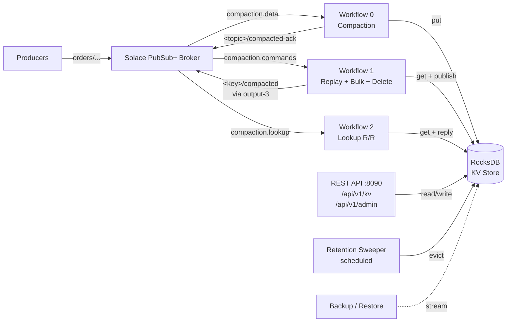
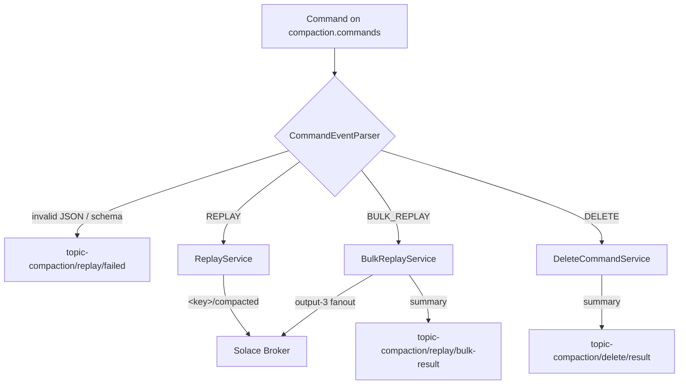
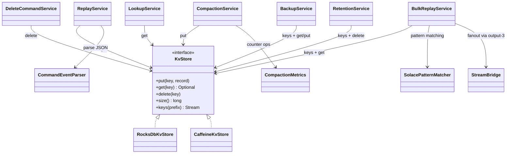

# Architecture

## Component overview

The Topic Compaction MI is a single-process Spring Boot application
on top of the Solace MI Framework. It receives messages from Solace
queues, persists their latest version per topic in a local RocksDB
KV store, and answers commands and lookups against that store.



## Workflows

Three Solace workflows backed by Spring Cloud Stream bindings.
Each has an inbound queue and an outbound producer. The MI
Framework controls start/stop, retries, ack-bridging, and health
per workflow.

| Workflow | Input queue | Default subscription | Egress |
|---|---|---|---|
| 0 - Compaction | `compaction.data` | `orders/>` | `<topic>/compacted-ack` (audit JSON) |
| 1 - Replay (single + bulk + delete) | `compaction.commands` | `compacted/command/>` | `<key>/compacted`, plus result events on `topic-compaction/replay/{failed,bulk-result}` and `topic-compaction/delete/result` |
| 2 - Lookup (request/reply) | `compaction.lookup` | `compacted/lookup/>` | reply-to of the request |

Workflow 1 dispatches by parsed `command` field:

- `REPLAY` -> `ReplayService`: rewrite the command-input message
  into a single replay message.
- `BULK_REPLAY` -> `BulkReplayService`: iterate matching keys,
  fan out via the dedicated `output-3` binding, publish a
  summary event.
- `DELETE` -> `DeleteCommandService`: tombstone the key (and
  optionally a cascade pattern), publish a delete-result event.



## Service layer

Stateless services around the `KvStore` interface (RocksDB or
Caffeine implementation):



## REST and Admin surface

Two controllers, both at `:8090`:

- `KvStoreController` at `/api/v1/kv`:
  - `GET /{*key}` (raw payload, default; or `?format=meta` for JSON
    metadata)
  - `DELETE /{*key}` (tombstone)
  - `GET /` (list with prefix + limit pagination)
- `AdminController` at `/api/v1/admin`:
  - `POST /backup` (streaming line-delimited JSON)
  - `POST /restore` (consume the same format)

Spring Boot Actuator exposes `:8090/actuator/{health,prometheus,
metrics,info}`. Health and Prometheus are public; everything
else requires the ADMIN role when security is enabled.

## Configuration model

Three layered config sources, lowest to highest precedence:

1. **In-image** `src/main/resources/application.yml`
   (defaults; not operator-edited).
2. **Operator overlay** at `/app/external/spring/config/
   application.yml` (mounted from a `ConfigMap` in K8s, or from
   `deploy/docker-compose/mi-config/` locally).
3. **Environment variables** (from a `Secret` in K8s or from
   `.env` locally). Holds sensitive values: broker credentials,
   REST passwords, OTLP endpoint.

See `docs/CONFIGURATION.md` for the full property reference.

## Observability pillars

```mermaid
flowchart LR
    MI[Topic Compaction MI] -->|Spring Boot<br/>Actuator| Prom[/actuator/prometheus]
    MI -->|JSON stdout<br/>logback k8s profile| Stdout
    MI -->|OTLP gRPC| Tempo[(Tempo)]
    Prom -->|ServiceMonitor| Prometheus[(Prometheus)]
    Stdout -->|Promtail| Loki[(Loki)]
    Prometheus --> Grafana
    Loki --> Grafana
    Tempo --> Grafana[Grafana<br/>monitoring.solace.lab]
    Grafana -->|trace ID| Tempo
    Grafana -->|trace ID| Loki
```

Trace IDs propagate from OpenTelemetry into the SLF4J MDC so log
lines link back to traces. See `docs/OBSERVABILITY.md` for the
full reference (metric names, log schema, sampling).

## Storage and durability

Records are stored in RocksDB using a length-prefixed binary
format (see `RecordCodec`):

- 1-byte version
- VarInt-prefixed UTF-8 strings
- 8-byte ingest + sender timestamps
- Type-tagged headers (string/long/int/bytes/bool, with a
  `toString()` fallback for unknown types)
- VarInt-prefixed payload bytes

We deliberately avoid Java serialization (insecure) and Jackson
(overhead) for the on-disk representation.

Persistence:

- RocksDB on local disk; in K8s mounted from a 10Gi PVC at
  `/var/lib/topic-compaction/rocksdb`.
- Graceful shutdown calls `db.syncWal()` before closing, so
  in-flight writes survive a SIGTERM.
- `RecordCodec` is forward-compatible: the version byte lets a
  future reader fall back to a legacy decoder.

## Loop protection

Every replay message carries the user-property header
`x-compacted-replay: true`. The compaction interceptor checks
this header first and returns immediately if set, without
touching the KV store. This prevents the obvious infinite loop:

1. Replay publishes on `<key>/compacted`.
2. The data queue subscribes broadly (`orders/>`) and could
   re-consume the replay.
3. Without protection, the replay would be stored as a new
   record under the new topic.
4. ... and so on.

In practice operators avoid subscribing the data queue to
`*/compacted`. The header check is defense in depth.

## Out-of-order handling

Optional. When `topic-compaction.compaction.ordering.header`
names a header containing a parseable `long` (e.g.
`senderTimestamp`), the compaction interceptor compares the
incoming value against the existing record's stored sender
timestamp and skips writes that would replace a newer value
with an older one.

Default: empty header name -> always-last-wins (Kafka
log-compaction parity).

## Lifecycle

```mermaid
sequenceDiagram
    participant K as Kubernetes
    participant Pod as MI Pod
    participant RDB as RocksDB
    participant Solace as Solace Broker

    K->>Pod: start container
    Pod->>RDB: open() -- @PostConstruct
    Pod->>Solace: connect SMF
    Pod->>Solace: bind workflows 0/1/2
    Pod-->>K: readiness probe UP
    Note over Pod: serving traffic

    K->>Pod: SIGTERM (rolling update)
    Pod-->>K: readiness DOWN<br/>(removed from service)
    Pod->>Solace: stop accepting new commands
    Pod->>Pod: drain in-flight HTTP (25s)
    Pod->>RDB: syncWal() + close() -- @PreDestroy
    Pod->>Solace: disconnect cleanly
    Pod-->>K: exit 0
    Note over K: PVC remains; new pod re-attaches
```

## Why interceptors and not Spring Cloud Stream Functions

The MI Framework expects every workflow to be
`input-binding -> transform -> output-binding`. To keep
Compaction visible as a true MI workflow in the Connector
Manager (rather than as a side-channel `Consumer<>` bean), we
use `ConsumerBindingMessageInterceptor` for the KV-store update
and `ProducerBindingMessageInterceptor` to rewrite the output
message into an audit event.

This pattern lets the MI Framework manage start/stop, retries,
ack-bridging, and health for our workflow while we stay in pure
Java for the business logic.

## See also

- `docs/CONFIGURATION.md` -- complete property reference
- `docs/COMMAND-EVENTS.md` -- replay/delete command schema
- `docs/OBSERVABILITY.md` -- metrics, logs, traces
- `docs/OPERATIONS.md` -- on-call runbook
- `docs/SECURITY.md` -- authn / authz model
- `docs/PERFORMANCE.md` -- baseline + capacity
- `docs/DIFFERENTIATORS.md` -- vs Kafka log compaction
- ADRs in `docs/adr/` -- design rationale
